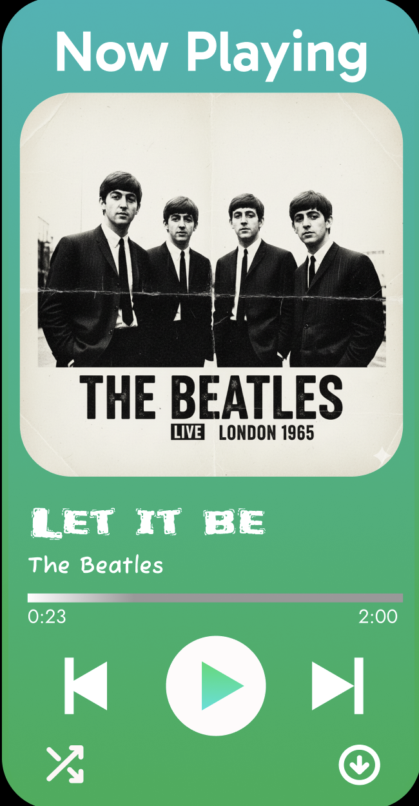

<p align="center">
  
</p>

<h1 align="center">🎵 FUSION — Music Streaming UI</h1>

<p align="center">
  <b>Figma Design → Pixel-Perfect Code</b><br/>
  A premium music streaming interface built from scratch by translating a Figma mockup into clean, responsive HTML & CSS.
</p>

<p align="center">
  
  
  
  
</p>

 https://govindjindal.github.io/PixelFlow_National-Week2025/
---

## 📸 Screenshots

| Figma Mockup | Final Coded UI |
|:---:|:---:|
|  |  |

<p align="center">
  
  &nbsp;&nbsp;&nbsp;
  
</p>

---

## ✨ Features

- 🎨 **Pixel-Perfect Figma Translation** — Every component faithfully recreated from the original Figma design
- 🌈 **Glassmorphism Sidebar** — Stunning gradient-border navigation panel with a neon glow effect
- 🎧 **Now Playing Card** — Vibrant gradient player widget with album art, progress bar & playback controls
- 🔍 **Music Discovery Feed** — Horizontally scrollable card lists for Trending, Popular Artists & Recently Played
- 🔐 **Auth UI** — Gradient Sign Up & Log In buttons with hover micro-animations
- 📱 **Social Media Bar** — Integrated links to Twitter/X, Instagram, Facebook, YouTube & TikTok
- 🖋️ **Premium Typography** — Google Fonts: `Montserrat`, `Poppins`, and `Permanent Marker`
- 🎯 **Font Awesome Icons** — Full icon set for navigation, playback controls & social links
- 🌙 **Dark Theme** — Sleek dark UI optimized for visual comfort

---

## 🏗️ Progressive Build Stages

The project was developed incrementally, stage by stage, to demonstrate the Figma-to-code workflow:

| Stage | File | Description |
|:---:|---|---|
| **1** | `Stage-1.html` | 🟢 **Now Playing Card** — Standalone gradient player widget with album art, song title, progress bar, and playback controls |
| **2** | `Stage-2.html` | 🔵 **Music Discovery** — Search bar + horizontally scrollable Trending, Popular Artists, and Recently Played sections |
| **3** | `Stage-3.html` | 🟣 **Combined Layout** — Merged Stage 1 & 2 into a side-by-side flexbox layout |
| **4** | `Stage-4.html` | 🟡 **Sidebar Navigation** — Glassmorphism sidebar with gradient border, library sub-menu, footer links & social icons |
| **Final** | `index.html` | 🔴 **Complete App** — All stages unified into a polished three-column layout with auth buttons, independent scrolling & custom scrollbars |

---

## 🛠️ Tech Stack

| Technology | Purpose |
|---|---|
| **HTML5** | Semantic structure & layout |
| **CSS3** | Flexbox layout, gradients, glassmorphism, transitions, custom scrollbars |
| **Google Fonts** | `Montserrat` · `Poppins` · `Permanent Marker` |
| **Font Awesome 6** | Navigation, playback & social media icons |
| **Figma** | Original UI/UX design source |

---

## 📂 Project Structure

```
PixelFlow_Repo/
├── index.html          # Final complete app (all stages combined)
├── Stage-1.html        # Now Playing player card
├── Stage-2.html        # Music discovery feed
├── Stage-3.html        # Combined player + discovery
├── Stage-4.html        # Glassmorphism sidebar
├── Images/
│   ├── Logo.png        # Fusion app logo
│   ├── Old Logo.png    # Previous logo iteration
│   ├── Figma UI.jpg    # Original Figma design mockup
│   ├── Main Section.png
│   ├── Player.png
│   └── Signup: Login.png
└── README.md
```

---

## 🚀 Getting Started

1. **Clone the repository**
   ```bash
   git clone https://github.com/GovindJindal/PixelFlow_National-Week2025.git
   cd PixelFlow_National-Week2025
   ```

2. **Open** `index.html` in your browser to see the final product — or open any `Stage-*.html` to explore the build process step by step.

> **No dependencies to install.** Everything runs with vanilla HTML, CSS and CDN-hosted fonts/icons.

---

## 🎨 Design Highlights

### Glassmorphism Sidebar
```css
background: linear-gradient(160deg, #00ffc2, #0075ff, #ff00e6);
box-shadow: 0 8px 32px 0 rgba(0, 204, 255, 0.37);
border-radius: 40px;
```

### Gradient Player Card
```css
background: linear-gradient(to bottom, #2DD4BF, #37D645);
border-radius: 30px;
```

### Auth Buttons
```css
/* Sign Up — gradient border trick */
background: linear-gradient(var(--bg-color), var(--bg-color)) padding-box,
            linear-gradient(to right, #ff2525, #9b00e8) border-box;

/* Log In — solid gradient */
background: linear-gradient(to right, #d32d56, #8134af);
```

---

## 👤 Author

**Govind Jindal**
Chitkara University · Evolve AI · Pixel-Vibe Coding · National Week 2025

---

## 📄 License

© 2025 FUSION. All rights reserved.
